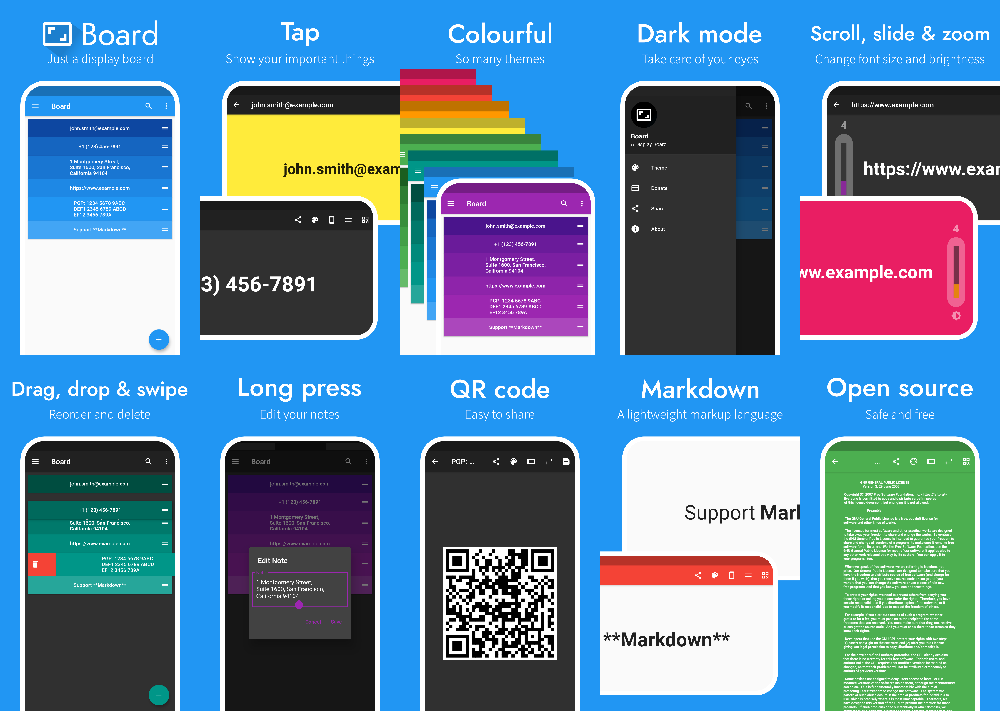

# Board


A Display Board.

## Screenshot



## Build

* Install Flutter

  ```bash
  git clone https://github.com/flutter/flutter.git -b stable
  export PATH="$PATH:`pwd`/flutter/bin"
  ```

* Run Flutter doctor

  ```bash
  flutter doctor
  ```

* Clone this repository

  ```bash
  git clone https://github.com/zyw271828/board.git && cd board
  ```

* Flutter build

  ```bash
  flutter build apk --split-per-abi
  ```
